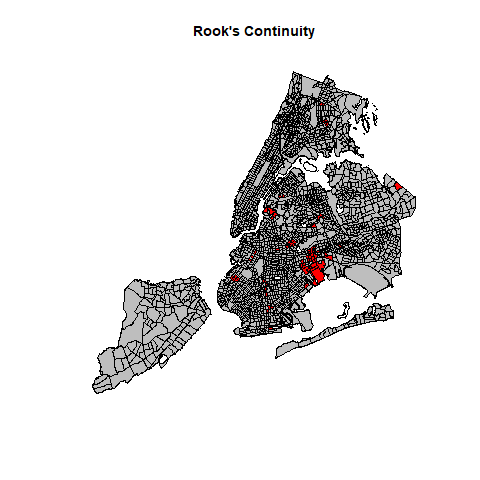

```{r setup, include=FALSE}
knitr::opts_chunk$set(echo = TRUE, results = 'hide', tidy.opts=list(width.cutoff=60), tidy = TRUE)
library(rgdal)
library(acs)
library(sp)
library(ggplot2)
library(rgdal)
library(chron)
library(spdep)
library(spatstat)
library(knitr)
```

# Introduction

In this project we wanted to determine whether or not the reasons given for stops in New York City indicate racial biases on the part of the officers. To address these questions, this project looks at the rate of stops because of clothing and because of furtive movements within census tracts. Therefore, we posed the following questions:

 1. Where are the “hotspots” (by census tract) of people being stopped for i. clothing, ii. furtive movements?
 
 2. What is the demographic breakdown of the census tracts these “hot spots” are happening in?
 
 3. What is the relative probability of being stopped for i. clothing, ii. furtive movements within their respective clusters?

# Materials and Methods

## Data and Pre-processing

  First, we acquired 2010 Census Tract polygons from NYC Open Data and demographic data from the American Community Survey. Race demographics were aggregated to match the Stop and Frisk racial categories. Percentages of each racial category in the total population were calculated. Census tract codes were standardized across files, which originally had different numbers for boroughs versus counties. The finalized racial demographic data was merged with the shape polygons.
  
```{r census tract, echo = TRUE, results = 'hide', eval = F}
# CENSUS TRACT POLYGONS

#read in shapefile
CT.boundaries <- readOGR("shape/2010_Census_Tracts/geo_export_bca342cd-a6e0-423a-849d-f4514a20112a.shp")


# CENSUS TRACT DATA FROM CENSUS API
#get demographic data
api.key.install(key = "3fd6f9caf6ea78674dc4362076df79153d95770c")
geo <- geo.make(state=c("NY"), county=c(5, 47, 61, 81, 85), tract="*")
#Bronx (Bronx County) = 5
#Brooklyn (King County) = 47
#Manhattan (New York County) = 61
#Queens (Queens County) = 81
#Staten Island (Richmond County) = 85

# Aggregate race demographics to match SQF race categories
race <- acs.fetch(endyear = 2011, geography = geo, 
                  table.number = "B03002", col.names = "pretty")
attr(race, "acs.colnames")

#create data.frame of relevant census data
cols.race <- c("Hispanic or Latino by Race: Total:",
  "Hispanic or Latino by Race: Not Hispanic or Latino: White alone",
  "Hispanic or Latino by Race: Not Hispanic or Latino: Black or African American alone",
  "Hispanic or Latino by Race: Not Hispanic or Latino: American Indian and Alaska Native alone",
  "Hispanic or Latino by Race: Not Hispanic or Latino: Asian alone",
  "Hispanic or Latino by Race: Hispanic or Latino: White alone",
  "Hispanic or Latino by Race: Hispanic or Latino: Black or African American alone")
race_df <- data.frame(race@geography$county, race@geography$tract, 
                      race@estimate[, cols.race], 
                      stringsAsFactors = FALSE)
rownames(race_df) <- 1:nrow(race_df)
names(race_df) <- c("county", "tract", "total_pop", "white", "black", "native.american", "asian", "white.hisp", "black.hisp")
race_df["other"] <- race_df$total_pop - (race_df$white + race_df$black + race_df$native.american + race_df$asia + race_df$white.hisp + race_df$black.hisp)

# Standardize census tract codes between shapefile (coded by borough) and census (coded by county)
race_df$county[race_df$county %in% 61] <- 1
race_df$county[race_df$county %in% 5] <- 2
race_df$county[race_df$county %in% 47] <- 3
race_df$county[race_df$county %in% 81] <- 4
race_df$county[race_df$county %in% 85] <- 5
race_df["boro_ct201"] <- paste(race_df$county, race_df$tract, sep = "")


# MERGE CENSUS TRACT DEMOGRAPHICS W/ SHAPE POLYS
race_merged <- merge(CT.boundaries, race_df, by = "boro_ct201")

#calculate percentages of total population
race_merged@data["per_white"] <- race_merged@data$white/race_merged@data$total_pop
race_merged@data["per_black"] <- race_merged@data$black/race_merged@data$total_pop
race_merged@data["per_nat.amer"] <- race_merged@data$native.american/race_merged@data$total_pop
race_merged@data["per_asia"] <- race_merged@data$asian/race_merged@data$total_pop
race_merged@data["per_whisp"] <- race_merged@data$white.hisp/race_merged@data$total_pop
race_merged@data["per_bhisp"] <- race_merged@data$black.hisp/race_merged@data$total_pop
race_merged@data["per_other"] <- race_merged@data$other/race_merged@data$total_pop

# Save SpatialPolygons object from merged census tract data
ct.sp <- SpatialPolygons(Srl=race_merged@polygons, pO=race_merged@plotOrder, proj4string=race_merged@proj4string)
save(ct.sp, file='data/ct.sp.rdata')
```

  
Next, the times variable in the Stop and Frisk data frame was first converted to class chron from the chron package in order to subset the data between 10:00 p.m to 6:00 a.m. The dates of stops were converted to date objects, and subsequently subsetted to Sunday through Thursday.

```{r stop and frisk, echo = TRUE, results = 'hide', eval = F}
# Load all SQF data
load("data/sqf.RData")

# SUBSETTING DATA
# Subset to 2011
sf2011 <- stops[stops$year==2011,]

# Subset to 10 p.m. to 6 a.m.
# First, we need to convert time to time & add trivial seconds place for time
sf2011$time <- chron(times=paste0(sf2011$time, ":00"))
sfnight <- sf2011[sf2011$time < chron(times="06:00:00") | sf2011$time > chron(times="22:00:00"),] 

# Subset to weeknights only
# convert date to date object
sfnight$date <- as.Date(sfnight$date)
# Add the day of the week to the data frame
sfnight$day <- weekdays(sfnight$date)
# Select only Sunday - Thursday
sf.final <- sfnight[sfnight$day %in% c('Sunday', 'Monday', 'Tuesday', 'Wednesday', 'Thursday'),]
```

The Census Tract and Stop and Frisk data were merged into one data frame. Any cases with missing latitude and longitude, or that occured in census tracts where no one lives and no stops were made (n = 13) were dropped. Variable names were updated for clarity. The final cleaned data set was saved as an .RData file.

```{r stop and frisk census merge, echo = TRUE, results = 'hide', eval = F}
# MERGING WITH CENSUS TRACT DATA
# Drop instances w/ missing lon, lat
apply(sf.final[, c('lon', 'lat')], MARGIN=2, FUN=function(col) {table(is.na(col))})
sf.final <- sf.final[!is.na(sf.final$lon) & !is.na(sf.final$lat),]

# Convert to SpatialPointsDataFrame
sf.final <- as.data.frame(sf.final)
coords <- sf.final[, c('lon', 'lat')]
sqf.spdf <- SpatialPointsDataFrame(coords, sf.final, proj4string=race_merged@proj4string)

# Variables of interest
sqf.vars <- c(names(sqf.spdf))
ct.vars <- c('boro_ct201', 'boro_name', 'ntaname',
    'white', 'black', 'native.american', 'asian', 'white.hisp', 'black.hisp', 'other', 'total_pop',
    'per_white', 'per_black', 'per_nat.amer', 'per_asia', 'per_whisp', 'per_bhisp', 'per_other')

# Merge with census tract data
require(GISTools)
race_merged@data$total.stops <- poly.counts(sqf.spdf, race_merged)
race_merged@data$stopped.clothing <- poly.counts(sqf.spdf[sqf.spdf@data$stopped.bc.clothing == TRUE,], race_merged)
race_merged@data$stopped.furtive <- poly.counts(sqf.spdf[sqf.spdf@data$stopped.bc.furtive == TRUE,], race_merged)

# SAVE CLEANED DATA
save(race_merged, file='data/ct_data.rdata')
```

Rates of stops for clothing and furtive movements were calculated for each census tract.

$$ Rate_i = \sum_{i=1} \frac{stopped.x_i}{total.stops_i}$$

where i signifies each census tract. Thus, there were 2,155 rates for each variable of interest. 

```{r rate calcs, echo = TRUE, results = 'hide', eval = F}
#Rate calculations
race_merged@data$rate.clothing <- race_merged@data$stopped.clothing/race_merged@data$total.stops
race_merged@data$rate.furtive <- race_merged@data$stopped.furtive/race_merged@data$total.stops
race_merged@data$rate.clothing[is.na(race_merged@data$rate.clothing)] <- 0
race_merged@data$rate.furtive[is.na(race_merged@data$rate.furtive)] <- 0

save(race_merged, file='data/race_merged.rdata')
```

## Spatial Analyses

For each of our reasons for stopping, we used both Rook and Queen’s continuity in obtaining the W matrix. Within each method, we used Moran’s I and Geary’s C as global tests for clusters in our data. The Monte Carlo versions of both functions were used, with 999 simulations. Since some census tracts do not have neighbors, we enforced a zero policy, which assigns a lagged value of 0 to the neighborless tracts. 

```{r global tests, echo = TRUE, results = 'hide', eval = F}
### Pre-process data
empty <- race_merged@data[race_merged@data$total_pop == 0 & race_merged@data$total.stops == 0
                          | is.na(race_merged@data$total_pop),]
rm <- !(race_merged$boro_ct201 %in% empty$boro_ct201)
race_merged2 <- race_merged[rm,]

# I. Clothing
## A. Rook Weighting
# Get the W matrix
set.seed(2090)
nbs <- poly2nb(race_merged2, queen = F)
lws <- nb2listw(nbs, zero.policy = T)
choropleth(race_merged2,race_merged2@data$rate.clothing)

### Moran's I
moran.test(race_merged2@data$rate.clothing,lws, zero.policy = T)
moran.mc(race_merged2@data$rate.clothing,lws,nsim=999, zero.policy = T)

### Geary's c
geary.test(race_merged2@data$rate.clothing,lws, zero.policy = T)
geary.mc(race_merged2@data$rate.clothing,lws,nsim=999, zero.policy = T)

## B. Queen Weighting
### Pre-process data
nbs <- poly2nb(race_merged2, queen = T)
lws <- nb2listw(nbs, zero.policy = T)
choropleth(race_merged2,race_merged2@data$rate.clothing)

### Moran's I
moran.test(race_merged2@data$rate.clothing,lws, zero.policy = T)
moran.mc(race_merged2@data$rate.clothing,lws,nsim=999, zero.policy = T)

### Geary's c
geary.test(race_merged2@data$rate.clothing,lws, zero.policy = T)
geary.mc(race_merged2@data$rate.clothing,lws,nsim=999, zero.policy = T)

# II. Furtive Movements
## A. Rook Weighting
### Pre-process data
# Get the W matrix
set.seed(2090)
nbs <- poly2nb(race_merged2, queen = F)
lws <- nb2listw(nbs, zero.policy = T)
choropleth(race_merged2,race_merged2@data$rate.furtive)

### Moran's I
moran.test(race_merged2@data$rate.furtive,lws, zero.policy = T)
moran.mc(race_merged2@data$rate.furtive,lws,nsim=999, zero.policy = T)

### Geary's c
geary.test(race_merged2@data$rate.furtive,lws, zero.policy = T)
geary.mc(race_merged2@data$rate.furtive,lws,nsim=999, zero.policy = T)

## B. Queen Weighting
### Pre-process data
nbs <- poly2nb(race_merged2, queen = T)
lws <- nb2listw(nbs, zero.policy = T)
choropleth(race_merged2,race_merged2@data$rate.clothing)

### Moran's I
moran.test(race_merged2@data$rate.furtive,lws, zero.policy = T)
moran.mc(race_merged2@data$rate.furtive,lws,nsim=999, zero.policy = T)

### Geary's c
geary.test(race_merged2@data$rate.furtive,lws, zero.policy = T)
geary.mc(race_merged2@data$rate.furtive,lws,nsim=999, zero.policy = T)
```

After conducting the global tests, local Moran’s I was used for each census tract. All p-values were adjusted due to multiple testing using Benjamini & Hochberg’s (1988) false discovery rate (“fdr”), which usually provides more power compared to methods like Bonferroni's correction. 

```{r local tests, echo = TRUE, results = 'hide', eval = F}
# I. Clothing
## A. Rook Weighting
set.seed(2090)
nbs <- poly2nb(race_merged2, queen = F)
lws <- nb2listw(nbs, zero.policy = T)

moran.loc.rook <-localmoran(race_merged2@data$rate.clothing,lws,p.adjust.method="fdr", zero.policy = T) 
shades <- shading(c(0.05),cols=c(2,8))
png("Clothing.rooklocal.png")
choropleth(race_merged2,moran.loc.rook[,"Pr(z > 0)"],shades)
title("Rook's Continuity",cex=.8)
dev.off()
## B. Queen Weighting
nbs <- poly2nb(race_merged2, queen = T)
lws <- nb2listw(nbs, zero.policy = T)

moran.loc.queen <-localmoran(race_merged2@data$rate.clothing,lws,p.adjust.method="fdr", zero.policy = T) 
shades <- shading(c(0.05),cols=c(2,8))
png("Clothing.queenlocal.png")
choropleth(race_merged2,moran.loc.queen[,"Pr(z > 0)"],shades)
title("Queen's Continuity",cex=.8)
dev.off()

# II. Furtive Movements
## A. Rook Weighting
set.seed(2090)
nbs <- poly2nb(race_merged2, queen = F)
lws <- nb2listw(nbs, zero.policy = T)

moran.loc.rook <-localmoran(race_merged2@data$rate.furtive,lws,p.adjust.method="fdr", zero.policy = T) 
shades <- shading(c(0.05),cols=c(2,8))
png("Furtive.rooklocal.png")
choropleth(race_merged2,moran.loc.rook[,"Pr(z > 0)"],shades)
title("Rook's Continuity",cex=.8)
dev.off()
## B. Queen Weighting
nbs <- poly2nb(race_merged2, queen = T)
lws <- nb2listw(nbs, zero.policy = T)

moran.loc.queen <-localmoran(race_merged2@data$rate.furtive,lws,p.adjust.method="fdr", zero.policy = T) 
shades <- shading(c(0.05),cols=c(2,8))
png("Furtive.queenlocal.png")
choropleth(race_merged2,moran.loc.queen[,"Pr(z > 0)"],shades)
title("Queen's Continuity",cex=.8)
dev.off()
```

## Relative Probabilities

For census tracts that were identified as “hotspots,” we calculated the relative probability of being stopped for each reason compared to being stopped for each reason in a non-hotspot, neighboring tract. 

```{r relative probabilities, echo = TRUE, results = 'hide', eval = F}

```

# Results
## Stopped for Clothing Commonly Worn in a Crime
### Global Tests

Both Moran’s I and Geary’s C were statistically significant, suggesting that stops for clothing are spatially autocorrelated. Results were consistent across rook and queen’s continuity.

\begin{table}[h]
\centering
\caption{pvalues for Moran's and Geary's MC}
\begin{tabular}{|l|l|l|}
\hline
 & Rook's Continuity & Queen's Continuity \\
\hline
Moran's I MC & 0.001 & 0.001 \\
Geary's C MC & 0.001 & 0.001 \\
\hline
\end{tabular}
\end{table}


### Local Tests

Local Moran’s I was used to examine the hotspots for wearing clothing associated with a crime. We see that there are very few differences between the two methods.




### Relative Probabilities

## Stopped for Furtive Movements
### Global Tests

Regardless of continuity type, both Moran’s I and Geary’s C were statistically significant, suggesting that stops for furtive movements are spatially autocorrelated. This necessitates further inspection.

\begin{table}[h]
\centering
\caption{pvalues for Moran's and Geary's MC}
\begin{tabular}{|l|l|l|}
\hline
 & Rook's Continuity & Queen's Continuity \\
\hline
Moran's I MC & 0.001 & 0.001 \\
Geary's C MC & 0.001 & 0.001 \\
\hline
\end{tabular}
\end{table}


### Local Tests

Local Moran’s I was used to examine the hotspots in furtive movements. We see that we get different clusters depending on the continuity method. Specifically, more census tracts are classified as hotspots using Rook’s continuity.


### Relative Probabilities

# Discussion

# Conclusion